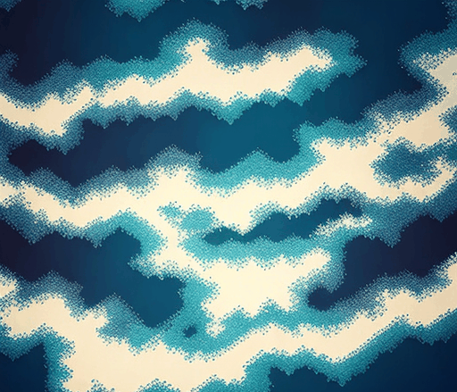

&nbsp;&nbsp; 
**ODYSSEY** 

&nbsp;&nbsp;  🌑 A dark text adventure

&nbsp;&nbsp;  🌑 Built with a simple React front-end fed by a json script

&nbsp;&nbsp;  🌑 Script updates: 
  &nbsp;&nbsp; 10/01/2024

 &nbsp;&nbsp; 

  <!--
**crmcleod/crmcleod** is a ✨ _special_ ✨ repository because its `README.md` (this file) appears on your GitHub profile.

Here are some ideas to get you started:

- 🔭 I’m currently working on ...
- 🌱 I’m currently learning ...
- 👯 I’m looking to collaborate on ...
- 🤔 I’m looking for help with ...
- 💬 Ask me about ...
- 📫 How to reach me: ...
- 😄 Pronouns: ...
- ⚡ Fun fact: ...
-->
