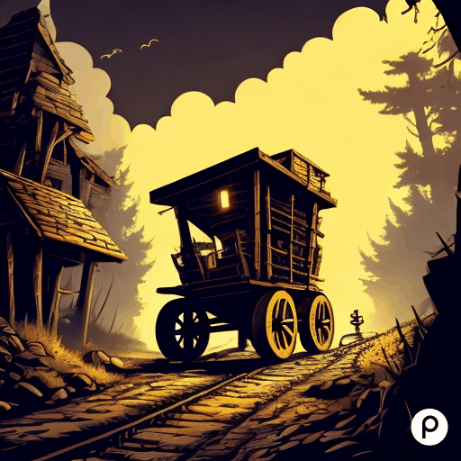
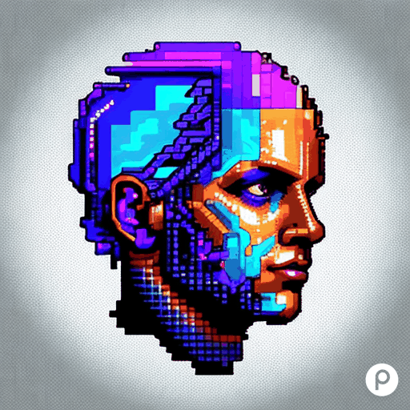

<h1>Current</h1>

&nbsp;&nbsp; 
**BURIED** 

&nbsp;&nbsp;  🌑 A dark text adventure set in a mine

&nbsp;&nbsp;  🌑 Built with a modified version of the game engine used in ODYSSEY
  
&nbsp;&nbsp;  🌑 <a href="https://github.com/crmcleod/cragglio">Github Repo</a> 

 &nbsp;&nbsp; 

  
 
 

&nbsp;&nbsp; 
**ODYSSEY** 

&nbsp;&nbsp;  🌑 A dark text adventure built with a simple React front-end, fed by a json script

&nbsp;&nbsp;  🌑 Script updates: 
  &nbsp;&nbsp; 10/01/2024
  
&nbsp;&nbsp;  🌑 <a href="https://github.com/crmcleod/cragglio">Github Repo</a> 

 &nbsp;&nbsp; 

  

&nbsp;&nbsp; 
**PORTFOLIO** 

&nbsp;&nbsp;  📺 Project portfolio

&nbsp;&nbsp;  📺 Built with React

&nbsp;&nbsp;  📺 Illustrations are my own

 &nbsp;&nbsp; 

  
  

&nbsp;&nbsp; 
**BLOG** 

&nbsp;&nbsp;  ✍️ RockRedUgly Blog

&nbsp;&nbsp;  ✍️ Built with React

&nbsp;&nbsp;  ✍️ Thoughts are my own 🧠

 &nbsp;&nbsp; 
 # In progress teasers

